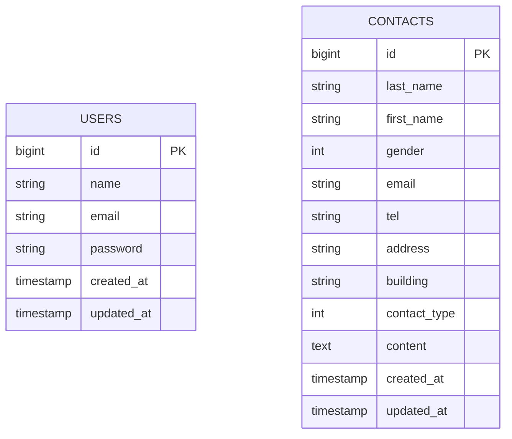

＃アプリケーション名
　coachtech お問い合わせフォーム
 
＃環境構築
　Dockerビルド
　git clone git@github.com:itou-nanase/test1.git
  cd coachtech/laravel/test1
　docker-compose up -d --build
  
  Laravel環境構築
  ・docker-compose exec php bash
  ・composer install
  ・cp .env.example .env
  ・php artisan key:generate
  ・php artisan migrate
  ・php artisan db:seed

  開発環境
  お問い合わせ画面：http://localhost
  ユーザー登録：http://localhost/register
  ログイン：http://localhost/login
  管理画面：http://localhost/admin/contacts
  PHPMyAdmin：http:localhost:8080
  
＃使用技術
PHP 8.x
Laravel 10.x
Laravel Fortify（認証）
MySQL
HTML / CSS / JavaScript
Docker

＃ER図

